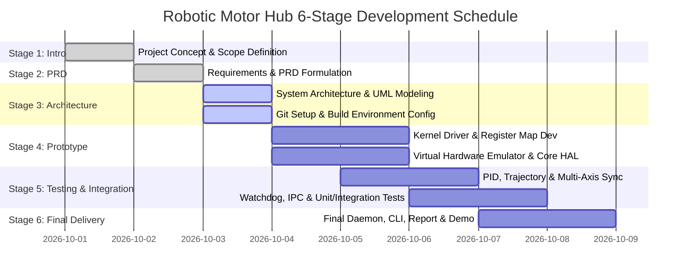

# Stage 2: Project Requirements & Development Plan (PRD)
## Robotic Multi-Axis Motor Controller & Actuator Hub

**Document Version:** 1.0.0  
**Status:** Approved for Implementation  
**Project Lead:** Embedded Systems & Robotics Engineer  

---

### 1. Functional Requirements (FR)

| ID | Requirement Title | Detailed Description | Priority |
|---|---|---|---|
| **FR-01** | Multi-Axis Hardware Control | The system must control up to 6 independent or synchronized motion axes (Axis 0 to Axis 5: X, Y, Z, A, B, C). | High |
| **FR-02** | Linux Device Driver & MMIO | The Linux kernel driver must expose a character device (`/dev/motor_hub`) allowing user-space programs to access control, status, target, and telemetry registers via `ioctl()`. | Critical |
| **FR-03** | High-Resolution Interrupt Emulation | The driver must simulate a 1 kHz hardware control tick and asynchronous encoder/limit-switch interrupts using Linux high-resolution timers (`hrtimer`) or event queues. | High |
| **FR-04** | Sysfs Diagnostic & Control Interface | The driver must provide `/sys/class/motor_hub/motor_hub0/` attributes for querying status, reading error registers, and forcing emergency stops from shell scripts. | Medium |
| **FR-05** | Closed-Loop PID Regulation | The C++ control core must execute a discrete-time PID algorithm per axis with proportional, integral, and derivative gains, anti-windup clamping, and deadband handling. | Critical |
| **FR-06** | Synchronized Trajectory Planning | The system must compute synchronized trapezoidal/S-curve velocity profiles such that all involved axes start and finish movement simultaneously. | High |
| **FR-07** | Finite State Machine (FSM) | Each axis must maintain an industrial-grade state machine: `UNINITIALIZED`, `IDLE`, `HOMING`, `RUNNING`, `ERROR`, and `EMERGENCY_STOP`. | Critical |
| **FR-08** | Real-Time Failsafe Watchdog | The system must continuously check for heartbeat timeout, tracking error divergence (> threshold), thermal limits, and limit-switch strikes; triggering instant E-stop upon violation. | Critical |
| **FR-09** | Inter-Process Communication (IPC) | The daemon must publish high-frequency telemetry via POSIX Shared Memory (`shm_open`) and accept commands via POSIX Message Queues / Unix Domain Sockets. | High |
| **FR-10** | Dual HAL Backend | The software must support both a production Linux kernel driver backend (`KernelDeviceDriverHAL`) and an emulation backend (`MockHardwareEmulatorHAL`) selectable via configuration. | High |

---

### 2. Non-Functional Requirements (NFR)

| ID | Requirement Category | Metric / Specification |
|---|---|---|
| **NFR-01** | **Control Loop Frequency** | The primary PID and interpolation loop must run deterministically at **1000 Hz (1.0 ms period)** with loop execution time $\le 150\,\mu\text{s}$. |
| **NFR-02** | **Scheduling Jitter** | Maximum loop jitter under normal operating conditions must be $\le 50\,\mu\text{s}$ using POSIX real-time scheduling (`SCHED_FIFO`). |
| **NFR-03** | **Emergency Stop Latency** | Emergency stop trigger to PWM disable must complete in $\le 1.0\,\text{ms}$. |
| **NFR-04** | **Memory Footprint** | Resident memory consumption (RSS) of the user-space daemon must not exceed **16 MB**. |
| **NFR-05** | **Resource Safety & RAII** | Codebase must strictly follow modern C++ (C++17) RAII guidelines: zero raw pointers for ownership, no dynamic allocations inside the 1 kHz periodic loop, zero memory leaks. |
| **NFR-06** | **Thread Safety** | Concurrency between the 1 kHz control loop, watchdog supervisor, and IPC receiver must be lock-free or protected with bounded mutex locks to avoid priority inversion. |
| **NFR-07** | **Portability & Modularity** | Abstract HAL must allow compiling and testing on standard Linux, WSL2, Ubuntu containers, and mock emulation environments. |
| **NFR-08** | **Maintainability & Code Quality** | Clean modular directory structure, Doxygen-style documentation, automated unit tests, and structured logging. |

---

### 3. Module Decomposition & Deliverables Matrix

```
robotic_motor_hub/
 ├── driver/                     [Module 1: Linux Kernel Device Driver]
 │    ├── motor_hub_driver.c     - Kernel module logic, char dev, hrtimer, sysfs
 │    ├── motor_hub_driver.h     - Kernel-internal structures & state
 │    └── motor_hub_uapi.h       - User-kernel shared IOCTL & register definitions
 │
 ├── include/ & src/common/      [Module 2: Common Types & Diagnostic Logging]
 │    ├── HardwareRegisters.hpp  - MMIO register bitfields & offsets
 │    ├── MotorTypes.hpp         - Axis states, trajectory structs, telemetry packets
 │    └── Logger.hpp             - Thread-safe structured logging engine
 │
 ├── include/ & src/hal/         [Module 3: Hardware Abstraction Layer (HAL)]
 │    ├── IHardwareDevice.hpp    - Generic abstract hardware interface
 │    ├── KernelDeviceDriverHAL  - Linux IOCTL & sysfs driver backend
 │    └── MockHardwareEmulatorHAL- Physics-based virtual motor & register emulator
 │
 ├── include/ & src/core/        [Module 4: Motion Control & Safety Core]
 │    ├── PIDController.hpp      - Discrete PID calculation with anti-windup
 │    ├── TrajectoryPlanner.hpp  - Trapezoidal multi-axis velocity profiler
 │    ├── MotorAxis.hpp          - Per-axis state machine and feedback tracking
 │    ├── MultiAxisController.hpp- Multi-axis synchronization coordinator
 │    └── FailsafeWatchdog.hpp   - Safety watchdog and limit monitoring
 │
 ├── include/ & src/ipc/         [Module 5: Inter-Process Communication]
 │    ├── SharedMemoryTelemetry  - POSIX shared memory ring buffer publisher/subscriber
 │    └── MessageQueueCommand    - POSIX message queue asynchronous command server
 │
 ├── src/daemon/ & src/cli/      [Module 6: Runtime Daemon & Interactive CLI]
 │    ├── main_controller_daemon - 1kHz real-time daemon entry point
 │    └── motor_cli_client       - Operator command-line interface
 │
 └── tests/ & scripts/           [Module 7: Verification & Simulation Suite]
      ├── unit & integration tests
      └── python simulation verification script
```

---

### 4. Development Plan & Timeline (6-Stage Milestone Schedule)



| Milestone | Stage | Key Deliverables | Success Criteria |
|---|---|---|---|
| **M1** | Stage 1 | Project Introduction Document | Problem statement, objectives, and scope defined. |
| **M2** | Stage 2 | Project Requirements Document (PRD) | Functional and Non-Functional Requirements, modular breakdown, timeline. |
| **M3** | Stage 3 | System Design & UML Specifications | Architecture diagrams, Class, Sequence, State Machine diagrams, Git strategy. |
| **M4** | Stage 4 | Driver & Core HAL Working Prototype | Working kernel driver source, mock hardware emulator, basic register read/write. |
| **M5** | Stage 5 | Multi-Axis Engine, IPC & Test Suite | Synchronized motion profiling, closed-loop PID, unit tests, benchmark suite. |
| **M6** | Stage 6 | Final Delivery, Report & CLI Demo | Complete functional daemon, operator CLI, final project report, and demo script. |
