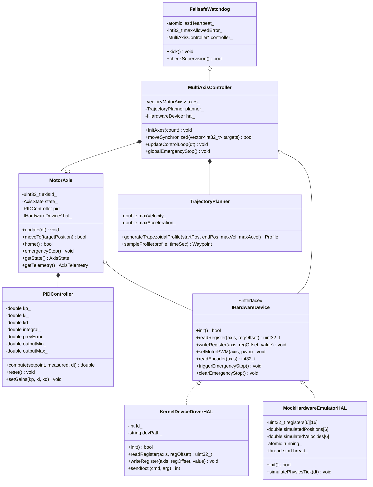
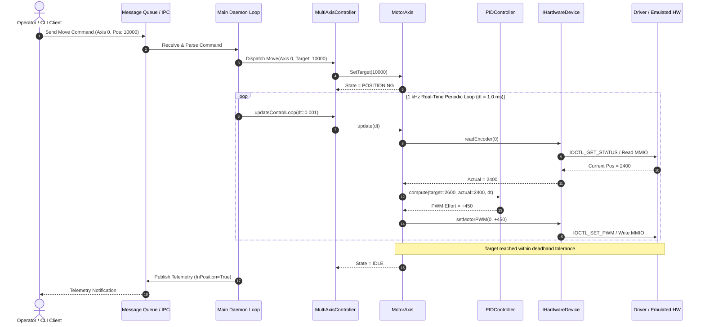
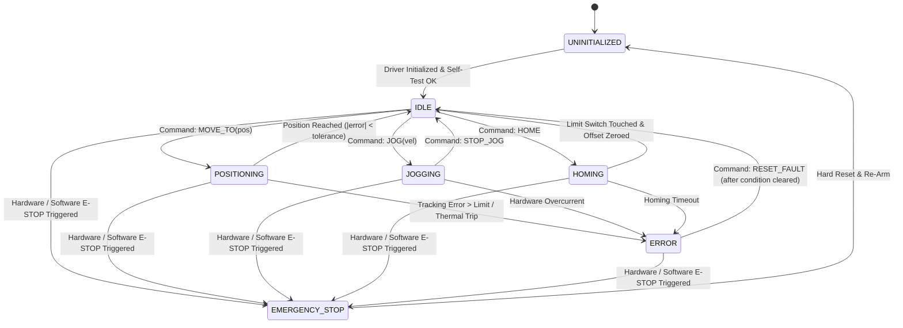

# Stage 3: System Design & Architecture
## Robotic Multi-Axis Motor Controller & Actuator Hub

**Document Version:** 1.0.0  
**Domain:** Robotics, Systems Architecture & Hardware-Software Co-Design  

---

### 1. Overall System Architecture

The system follows a strict 5-layer decoupled architecture spanning hardware emulation, kernel-space device drivers, hardware abstraction, real-time control, and IPC/application layers:

```mermaid
graph TD
    subgraph Layer5["Layer 5: User & Operator Layer"]
        CLI["Motor CLI Client<br/>(Interactive Operator Interface)"]
        GUI["External GUI / ROS Node / Telemetry Monitor"]
    end

    subgraph Layer4["Layer 4: Inter-Process Communication (IPC)"]
        SHM["POSIX Shared Memory<br/>(/dev/shm/motor_telemetry)"]
        MQ["POSIX Message Queue / Unix Domain Socket<br/>(/tmp/motor_hub.sock)"]
    end

    subgraph Layer3["Layer 3: Real-Time Motion Control Core (C++ Daemon)"]
        Daemon["Main Controller Daemon<br/>(1 kHz Periodic Loop, SCHED_FIFO)"]
        MultiAxis["Multi-Axis Coordinator<br/>(Synchronized Interpolator)"]
        Traj["Trajectory Planner<br/>(Trapezoidal / S-Curve)"]
        PID["PID Controller<br/>(Discrete Anti-Windup)"]
        Watchdog["Failsafe Watchdog<br/>(Heartbeat, Tracking Error, Limits)"]
    end

    subgraph Layer2["Layer 2: Hardware Abstraction Layer (HAL)"]
        IHAL["<<interface>><br/>IHardwareDevice"]
        KernelHAL["KernelDeviceDriverHAL<br/>(Linux /dev/motor_hub IOCTL)"]
        MockHAL["MockHardwareEmulatorHAL<br/>(In-Memory MMIO + Physics Sim)"]
    end

    subgraph Layer1["Layer 1: Kernel Driver & Hardware/Emulation"]
        KMod["Linux Kernel Module<br/>(motor_hub_driver.ko)<br/>Char Device /dev/motor_hub<br/>Sysfs /sys/class/motor_hub"]
        HW["Hardware Peripheral / MMIO Registers<br/>(PWM Generator, Quadrature Encoder, IRQ Lines)"]
    end

    CLI -->|Commands| MQ
    MQ -->|Dispatch| Daemon
    Daemon -->|Update| MultiAxis
    MultiAxis --> Traj
    MultiAxis --> PID
    Daemon --> Watchdog
    MultiAxis --> IHAL
    IHAL <|.. KernelHAL
    IHAL <|.. MockHAL
    KernelHAL -->|ioctl / sysfs| KMod
    MockHAL -->|Direct Emulation| HW
    KMod --> HW
    Daemon -->|Publish 1 kHz| SHM
    SHM -->|Zero-Copy Read| CLI
    SHM -->|Zero-Copy Read| GUI
```

---

### 2. Major Components & Responsibilities

1. **Linux Kernel Driver (`motor_hub_driver.c`)**:
   - Manages physical or emulated motor controller hardware registers.
   - Provides character device node `/dev/motor_hub` with dynamic allocation.
   - Handles `open()`, `release()`, `unlocked_ioctl()` for high-throughput commands.
   - Simulates periodic hardware interrupts using Linux high-resolution timer (`hrtimer`).
   - Exposes sysfs attributes for emergency stop override and diagnostics.

2. **Hardware Abstraction Layer (`IHardwareDevice`)**:
   - Decouples user-space motion logic from concrete hardware communication methods.
   - Seamlessly switches between the production Linux kernel driver and high-fidelity mock emulation.

3. **Multi-Axis Motion Coordinator (`MultiAxisController`)**:
   - Coordinates multi-axis operations (e.g. Cartesian X-Y-Z moves).
   - Scales axis velocities and accelerations so that all axes start and finish synchronously.

4. **Closed-Loop PID Regulator (`PIDController`)**:
   - Computes corrective PWM duty-cycle: $u(t) = K_p e(t) + K_i \int e(t)dt + K_d \frac{de(t)}{dt}$.
   - Features integrator anti-windup clamping and derivative low-pass filter.

5. **Safety & Failsafe Watchdog (`FailsafeWatchdog`)**:
   - Supervises tracking error ($|target - actual| \le threshold$).
   - Monitors temperature and software heartbeat.
   - Instantly commands hardware-level emergency stop upon violations.

6. **Inter-Process Communication Subsystem (`IPC`)**:
   - Lock-free POSIX Shared Memory telemetry ring buffer for real-time visualization.
   - Asynchronous message queue for external operator commands.

---

### 3. Data Structures & Register Map Specifications

#### 3.1 Hardware MMIO Register Layout (Per-Axis, 32-bit width)
```
Offset    Register Name      Access   Description
--------------------------------------------------------------------------
0x00      AXIS_CTRL_REG      R/W      Bit 0: Enable, Bit 1: Reset, Bit 2: E-Stop
0x04      AXIS_STATUS_REG    RO       Bit 0: Enabled, Bit 1: InPosition, Bit 2: Error, Bit 3: LimitHit
0x08      TARGET_POS_REG     R/W      Desired target position (encoder ticks)
0x0C      ACTUAL_POS_REG     RO       Current measured position (encoder ticks)
0x10      TARGET_VEL_REG     R/W      Desired target velocity (ticks/sec)
0x14      ACTUAL_VEL_REG     RO       Current measured velocity (ticks/sec)
0x18      PWM_OUTPUT_REG     R/W      Applied PWM effort [-1000 to +1000]
0x1C      KP_GAIN_REG        R/W      Proportional gain (fixed-point Q16.16)
0x20      KI_GAIN_REG        R/W      Integral gain (fixed-point Q16.16)
0x24      KD_GAIN_REG        R/W      Derivative gain (fixed-point Q16.16)
0x28      LIMIT_SWITCH_REG   RO       Bit 0: Min Limit, Bit 1: Max Limit
0x2C      IRQ_STATUS_REG     R/W1C    Interrupt status (Bit 0: Tick, Bit 1: Fault)
```

#### 3.2 Core Data Structures in C++
```cpp
// Axis State Enum
enum class AxisState : uint8_t {
    UNINITIALIZED = 0,
    IDLE          = 1,
    HOMING        = 2,
    POSITIONING   = 3,
    JOGGING       = 4,
    ERROR         = 5,
    EMERGENCY_STOP= 6
};

// Telemetry Packet published via Shared Memory
struct alignas(64) AxisTelemetry {
    uint32_t axis_id;
    AxisState state;
    int32_t target_position;
    int32_t actual_position;
    int32_t tracking_error;
    int32_t target_velocity;
    int32_t actual_velocity;
    int16_t pwm_effort;
    uint16_t status_flags;
    uint64_t timestamp_ns;
};

struct alignas(128) SystemTelemetryPacket {
    uint64_t sequence_number;
    uint64_t timestamp_ns;
    uint32_t active_axes;
    bool emergency_stop_active;
    AxisTelemetry axes[6];
};
```

---

### 4. UML Diagrams

#### 4.1 UML Class Diagram


#### 4.2 UML Sequence Diagram: Motion Command Execution


#### 4.3 UML State Machine Diagram: Motor Axis Lifecycle


---

### 5. Git Repository & Branching Strategy

To maintain rigorous version control throughout the 6-stage lifecycle, the project adheres to a structured **GitFlow** branching model:
- `main`: Production-ready releases tagged at milestone completions (`v0.1.0` to `v1.0.0`).
- `develop`: Integration branch where completed stage features are merged.
- `feature/stageX-<module>`: Work-in-progress branches for specific modules:
  - `feature/stage1-docs`: Project initiation.
  - `feature/stage2-prd`: Requirements & PRD.
  - `feature/stage3-architecture`: Architecture & UML.
  - `feature/stage4-driver-prototype`: Kernel driver & prototype emulator.
  - `feature/stage5-control-ipc-tests`: PID, trajectory, IPC, and unit tests.
  - `feature/stage6-final-system`: Daemon, CLI, and final reports.
