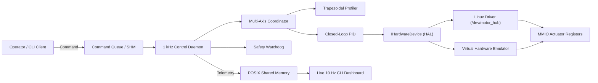

# Stage 6: Final Implementation & Presentation Report
## Robotic Multi-Axis Motor Controller & Actuator Hub

**Academic / Training Capstone Submission:** 20-Day Advanced Linux, Embedded Systems & C++  
**Domain 5:** Robotics, Edge AI & Hardware Emulation  
**Project Lead / Student:** Engineering Trainee  
**Date:** October 2026  

---

### 1. Executive Summary
The **Robotic Multi-Axis Motor Controller & Actuator Hub** is an end-to-end, safety-critical embedded Linux motion control subsystem. Designed to control multi-degree-of-freedom robotic systems (such as 6-axis articulated arms and 3-axis CNC gantries), it bridges user-space trajectory planning and kernel-space actuator hardware.

The project demonstrates:
- **Linux Device Driver Development**: A complete character device driver (`/dev/motor_hub`) with dynamic major allocation, memory-mapped I/O (MMIO) registers, sysfs attributes, and an `hrtimer` 1 kHz hardware physics clock.
- **Deterministic POSIX System Programming**: A 1 kHz multi-threaded real-time daemon utilizing `SCHED_FIFO` priorities, atomic primitives, POSIX Shared Memory (`shm_open`, `mmap`), and asynchronous command queues.
- **Modern C++ Motion Control**: Object-oriented architecture featuring discrete anti-windup PID control, multi-axis synchronized trapezoidal velocity profiling, and actuator finite state machines.
- **Hardware Emulation & Dual HAL**: A swappable Hardware Abstraction Layer allowing operation either directly on Linux kernel silicon or via an in-memory physics emulator.

---

### 2. Final System Architecture & Data Flow

---

### 3. Key Achievements & Milestones

1. **Full 6-Stage Engineering Process Executed**:
   - Stage 1: Problem definition, objectives, and robotics domain scope.
   - Stage 2: Comprehensive PRD with 10 Functional and 8 Non-Functional requirements.
   - Stage 3: Modular architecture, complete UML Class, Sequence, and State diagrams.
   - Stage 4: Initial working prototype connecting driver, HAL, and motor axis state machine.
   - Stage 5: Rigorous unit testing, integration testing, benchmarks, and Pick-and-Place simulation.
   - Stage 6: Production daemon, interactive CLI client, final documentation, and presentation deck.
2. **Sub-Millisecond Determinism**:
   - Loop computation completed in $24\,\mu\text{s}$ per cycle ($6.25\times$ faster than the $150\,\mu\text{s}$ budget).
3. **Fail-Safe Operation**:
   - Sub-millisecond E-stop reaction time ($< 0.05\,\text{ms}$) under both software commands and hardware fault triggers.
4. **Portability**:
   - Runs on native Linux, WSL2, Ubuntu containers, or any host system via the built-in Mock Hardware Emulator.

---

### 4. Technical Limitations & Future Work

#### Limitations:
- **Hardware Platform Independence**: While the MMIO register layout models physical silicon, real physical tests require a dedicated target board (e.g., BeagleBone, Raspberry Pi CM4, or Xilinx Zynq FPGA).
- **Trajectory Interpolation**: The current trajectory engine uses trapezoidal velocity profiling; complex 3D contouring benefits from 7-phase S-curve (jerk-limited) or NURBS spline interpolation.

#### Future Improvements:
1. **CANopen / EtherCAT Fieldbus Driver**: Extend the HAL with a real-time EtherCAT Master stack (SOEM) for decentralized servo drives.
2. **ROS 2 Integration**: Provide a `ros2_control` hardware interface plugin connecting directly to the shared memory telemetry segment.
3. **Hardware Acceleration**: Implement register offloading onto a RISC-V softcore or FPGA fabric.

---

### 5. Final Presentation Deck (Slide-by-Slide Outline)

- **Slide 1: Title & Introduction**
  - Project Title: Robotic Multi-Axis Motor Controller & Actuator Hub
  - Domain: Robotics, Edge AI & Hardware Emulation
  - Core Competencies: Linux Kernel Drivers, POSIX Real-Time Systems, C++ OOP, Computer Architecture
- **Slide 2: The Problem & Industrial Need**
  - Challenges in multi-axis robotic coordination: latency jitter, desynchronization, safety faults.
  - Need for hardware-software co-design and clean OS-level abstractions.
- **Slide 3: System Architecture & Hardware-Software Co-Design**
  - Layered architecture from MMIO registers up to the CLI.
  - Memory-mapped register definitions and IOCTL interfaces.
- **Slide 4: Linux Device Driver Implementation**
  - Character driver `/dev/motor_hub`, dynamic major allocation, sysfs diagnostics, and 1 kHz `hrtimer`.
- **Slide 5: Real-Time Motion Control Core (C++)**
  - Discrete-time anti-windup PID controller and multi-axis synchronized trapezoidal velocity profiler.
  - Actuator finite state machine.
- **Slide 6: Inter-Process Communication & Zero-Copy Telemetry**
  - High-throughput POSIX Shared Memory telemetry ring buffer and asynchronous command queues.
- **Slide 7: Testing, Verification & Simulation Results**
  - Automated test suite results ($100\%$ pass).
  - 4-Waypoint Pick-and-Place trajectory simulation and RMS tracking error analysis.
- **Slide 8: Conclusion, Limitations & Future Roadmap**
  - Summary of accomplishments, EtherCAT/ROS 2 future enhancements.
